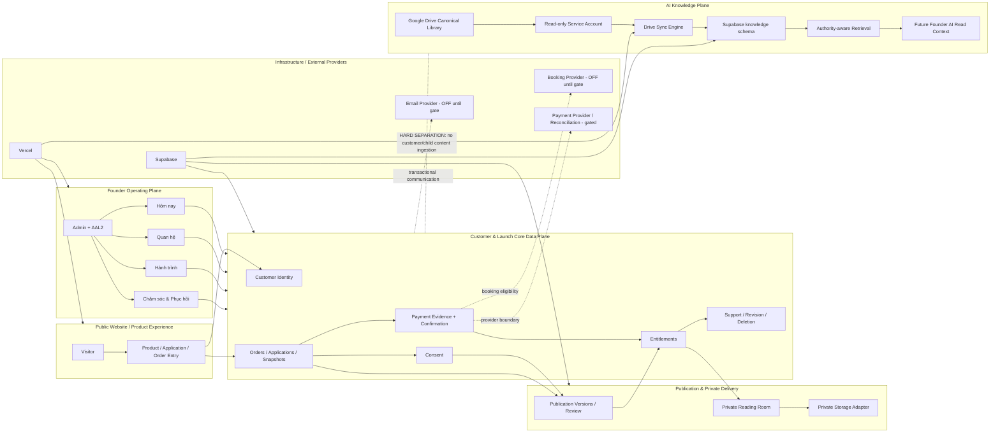
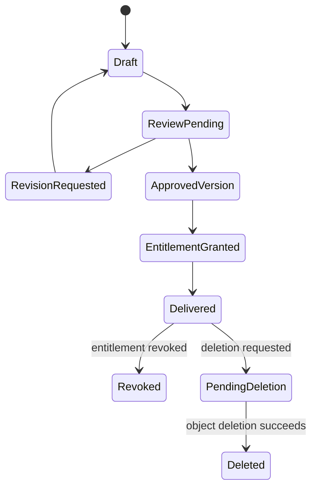
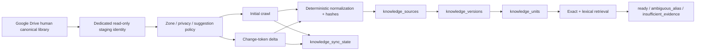
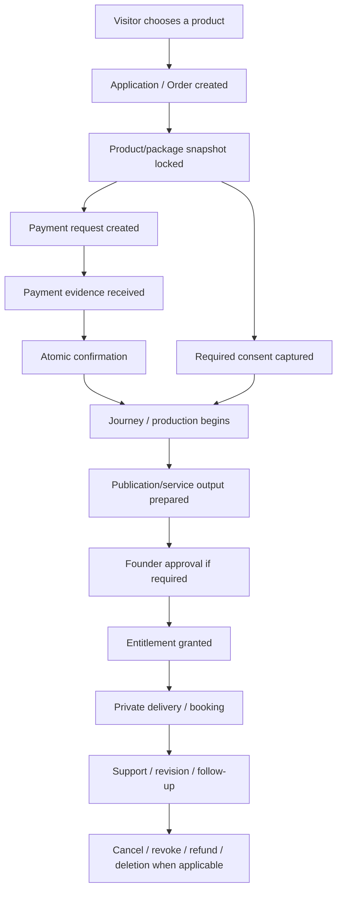
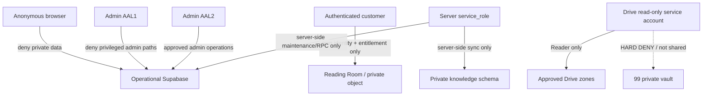

# ESSENCE Backend — System Map

**Owner:** Kenji Phạm  
**Purpose:** A durable map of the backend so Founder, AI and engineers can see what each layer does, where it lives, what data it may touch, and what must be updated together.  
**Authority:** Navigation/architecture evidence only. It does not create product, privacy, payment or release decisions.

---

## 1. The simplest mental model

Think of the backend as **five houses connected by controlled doors**, not one giant database.

```text
1. CUSTOMER HOUSE
   Who is this person? What did they ask for/buy? What may they access?

2. DELIVERY HOUSE
   What version was approved? What is delivered? Can access be revoked/deleted safely?

3. FOUNDER OFFICE
   What does Kenji need to see, decide, care for or do next?

4. KNOWLEDGE LIBRARY
   What does ESSENCE currently know and which source has authority?

5. INFRASTRUCTURE & SECURITY
   Who/what is allowed to talk to each house, in which environment, with which credentials?
```

The most important boundary is:

> **Customer/private operational data and AI knowledge data are separate planes.**

The Knowledge Backend must not become a shortcut around customer authorization or child/private-data rules.

---

## 2. Whole-system map



---

## 3. Layer map

### Layer A — Public experience

**Question it answers:** What can a visitor see/do before they become a customer?

**Contains:** public product pages, application/order entry, future contact/lead capture and public release surfaces.

**Must not do:** expose service-role credentials, private objects, child data, internal AI knowledge or Admin-only state.

**Current release truth:** backend foundations exist in Draft/staging branches; production activation remains separate.

---

### Layer B — Customer / Launch Core

**Question it answers:** Who is the customer, what is their product journey, what is the authoritative order/payment/entitlement state?

Core concepts:

```text
Customer Identity
      ↓
Application / Order
      ↓
Immutable Product/Package Snapshot
      ↓
Payment Request + Evidence
      ↓
Atomic Confirmation
      ↓
Journey / Production State
      ↓
Entitlement
```

Important contracts:

- identity ≠ Admin identity;
- order history is immutable snapshot evidence;
- payment evidence cannot confirm the wrong request/order;
- confirmation is idempotent;
- entitlement is explicit and revocable;
- support/revision/deletion attach to safe customer/order/entitlement identifiers;
- child/private fields do not become identifiers or URL/object-path material.

**Main implementation base:** PR #136 / `feat/wp3-launch-core-backend` and its migrations `0022–0027`.

---

### Layer C — Publication & Delivery

**Question it answers:** Which approved version is the customer entitled to, and how is it delivered privately?



Rules:

- draft is never equivalent to delivered;
- Founder approval locks version evidence;
- a revision creates a new version rather than rewriting the approved historical version;
- Reading Room checks verified identity + active entitlement every time;
- object storage is an adapter behind authorization, not the authority itself;
- deletion is object-first/fail-closed and retryable.

**Current state:** contracts exist; real private Storage/PDF/signed-download/deletion provider E2E remains a launch gate.

---

### Layer D — Founder Office / Operations

**Question it answers:** What should Kenji understand, decide or do now?

The Founder layer should consume operational facts from the customer backend and turn them into usable work, without inventing scores or psychological profiles.

Current conceptual workspaces:

```text
Hôm nay
├─ việc cần xử lý
├─ hạn / rủi ro / sức chứa
└─ hàng đợi vận hành

Quan hệ
├─ tổng quan
├─ sản phẩm
├─ Phòng đọc
├─ hành trình
├─ chăm sóc
├─ lời hứa
└─ dòng thời gian

Hành trình
└─ state + dependency + next operational step

Chăm sóc & Phục hồi
└─ care, recovery, deliberate silence, next best care
```

**Current state:** WP3.5 proves experience/logic direction with synthetic fixtures only. It is not yet a connected CRM or autonomous action system.

---

### Layer E — AI Knowledge Backend

**Question it answers:** What does ESSENCE know, which source wins, and what evidence should Founder AI rely on?



Hard boundaries:

- Drive remains the human canonical source;
- Machine Library is derived/rebuildable;
- `99_KHO RIÊNG TƯ` is never crawled/read by the sync identity;
- customer, child-sensitive, payment and session-note data are outside this data plane;
- unresolved Google Docs suggestions are checked before canonical ingest;
- no browser access to `knowledge` schema;
- no model/provider/vector search is required for M2;
- no autonomous database/business write action.

---

## 4. Data-store map

| Store | Purpose | May contain customer data? | May contain child-sensitive data? | Runtime role |
|---|---|---:|---:|---|
| Supabase operational tables | orders, applications, payment, consent, entitlement, publication, support, audit | Yes, minimized | Only within explicitly governed product tables/boundaries | Customer/Founder operations |
| Supabase private `knowledge` schema | derived authority/retrieval corpus | **No** | **No** | Founder knowledge retrieval only |
| Google Drive canonical library | human-managed ESSENCE knowledge | Governance/canonical knowledge only for sync scope | `99` excluded from sync identity | Source of truth for Knowledge Backend |
| Private object storage | approved deliverables/publication assets | Yes, authorized delivery only | Potentially sensitive; safe paths required | Delivery adapter |
| GitHub | code, migrations, docs, synthetic fixtures only | **No real customer data** | **No** | Versioned implementation/governance evidence |
| Vercel | application runtime + Preview/Production env vars | No durable customer store | No | Compute / deployment |

---

## 5. Customer Golden Journey map

This is the end-to-end business flow that future readiness work must prove with synthetic staging data before real customers.



### Golden Journey must eventually prove all of these

- happy path;
- duplicate payment/webhook does not duplicate confirmation/order effects;
- payment failure/retry;
- booking/provider failure;
- email delivery failure/retry;
- cross-customer access denial;
- expired/revoked entitlement;
- revision creates a new version;
- cancellation/refund does not silently equal deletion;
- deletion fails closed if object deletion fails;
- Founder can see what needs attention without exposing unnecessary sensitive data.

---

## 6. Knowledge sync E2E map

There are **two probe routes** and they serve different purposes.

### Diagnostic/in-memory probe

`/api/internal/m2b-drive-sync-probe`

Purpose:

- prove Google identity + Drive API/Docs API + sync engine behavior;
- diagnose safe error codes;
- does **not** prove Machine Library persistence.

### Real persistence probe

`/api/internal/m2b-drive-supabase-probe`

Purpose:

```text
Google Drive fixture
→ service account
→ Drive/Docs APIs
→ sync engine
→ SupabaseKnowledgeSyncRepository
→ service-role-only RPC
→ knowledge_sources
→ knowledge_versions
→ knowledge_units
→ knowledge_sync_state
```

Phases:

```text
initial
→ edit
→ removal
→ cleanup
```

Fixture profile is deliberately non-authoritative:

```text
source_role      implementation_evidence
authority        L6
lifecycle        reference
usage_mode       workspace
runtime_enabled  false
synthetic        true
```

This prevents test content from becoming current Founder truth.

---

## 7. Security door map



Security is layered. No single control is sufficient by itself.

Examples:

- signed URL without entitlement check is not enough;
- Supabase key secrecy without RLS is not enough;
- a Drive folder ID without permission isolation is not enough;
- a random publication slug is not customer authorization;
- AI instructions are not an authorization mechanism.

---

## 8. Environment map

### Local / test

Use for deterministic unit/contract tests and synthetic fixtures. Never use local success as evidence that a provider or cloud permission works.

### `essence-staging`

Purpose:

- database migrations;
- RLS/security probes;
- synthetic customer/backend E2E;
- Machine Library persistence;
- no real customer/child data unless a later explicit controlled-data authorization exists.

### Vercel Preview

Purpose:

- exact-branch runtime E2E;
- protected internal probe routes;
- provider staging tests when separately authorized.

A test counts only if the Preview commit equals the intended branch head.

### Production

Current M1/M2/WP3 changes are not automatically active merely because staging works.

Production activation requires a separate release gate, secrets/provider review and Founder authorization.

---

## 9. Component registry — where to look when something breaks

| Problem / change | First code/docs to inspect | Evidence to re-run |
|---|---|---|
| Customer identity / entitlement | WP3 migrations and Launch Core contract | RLS + cross-customer authorization |
| Payment confirmation | WP3 payment request/evidence/confirmation functions | atomicity, idempotency, wrong-request reuse |
| Publication/versioning | publication version/review/revision contracts | approved-version-before-entitlement |
| Reading Room | customer identity link + entitlement + private storage adapter | cross-customer/direct-object/revoked/expired denial |
| Child/privacy boundary | Hạt Mầm consent/snapshot/policy + RLS | no names in identifiers/paths/logs; minimized fields |
| Founder Admin access | Admin gate/AAL2 + RLS | non-admin deny, AAL1 deny, AAL2 allow |
| Drive auth | `google-drive-service-account.ts` | token scope + identity runtime probe |
| Drive API/Docs API | `google-drive-client.ts` | safe runtime error code + suggestion inspection |
| Drive crawl/delta | `sync-engine.ts`, `drive-sync.ts`, `drive-root-map.ts` | initial/edit/removal allowlist sequence |
| Machine Library persistence | `supabase-sync-client.ts`, `supabase-sync-repository.ts`, sync RPC migrations | initial/edit/removal/cleanup real staging probe |
| Knowledge authority | `retrieval.ts`, `retrieval-decision.ts` | 10 Gold Cases incl. FCP ambiguity |
| Deployment/runtime | Vercel Preview exact head | build + runtime logs |

---

## 10. Change-coupling map — what must be updated together

### If you change a customer/order state

Update/check together:

- DB enum/constraint/transition function;
- Admin/Founder UI labels;
- audit event vocabulary;
- retry/idempotency expectations;
- Golden Journey test;
- any email/provider trigger derived from that state.

### If you change product price/package/delivery promises

Do **not** rewrite historical orders. Update/check:

- current product settings/contract;
- snapshot creation logic;
- payment amount validation;
- entitlement/delivery promises;
- new-order tests;
- Founder Decision/approved product contract if required.

### If you change Reading Room access

Update/check together:

- verified identity contract;
- entitlement policy;
- RLS/server authorization;
- signed-object adapter;
- revocation/expiry;
- cross-customer negative tests;
- audit evidence.

### If you change Knowledge sync

Update/check together:

- Drive root policy;
- Docs suggestion gate;
- allowlist/privacy rules;
- hash/normalization semantics;
- persistence adapter/RPC;
- checkpoint/removal semantics;
- retrieval regression;
- `99` denial evidence.

### If you add an AI capability

Before implementation answer four questions:

1. Which data plane may it read?
2. Which authority sources may it trust?
3. Is it READ, DRAFT, PROPOSE or ACT?
4. What explicit approval/audit boundary prevents autonomous business action?

No AI feature may silently bridge the Knowledge plane into customer/child/private operational data.

---

## 11. Release-gate map toward real customers

```mermaid
flowchart LR
  A[Foundation contracts]
  B[Staging security]
  C[Providers + private storage]
  D[Golden Customer Journey]
  E[Failure / recovery rehearsal]
  F[Founder Operating visibility]
  G[Production rehearsal]
  H[Founder release decision]
  I[Real customers]

  A --> B --> C --> D --> E --> F --> G --> H --> I
```



Where we are now:

- foundation contracts: substantially built in Draft branches;
- staging security: strong partial evidence exists;
- providers/private storage: still open;
- Golden Customer Journey: not yet complete;
- failure/recovery rehearsal: not yet complete;
- connected Founder operations: not yet complete;
- Production rehearsal/release: not started for this stack.

This is why the next business-smart program after closing the current M2B gate is **Backend Customer Readiness**, not more speculative AI infrastructure.

---

## 12. Maintenance protocol for future AI / engineers

Before changing backend code:

1. identify the layer on this map;
2. identify the authoritative contract/Founder Decision for that layer;
3. identify which adjacent layers the change can affect;
4. inspect current PR/migration/runtime state rather than relying on old chat summaries;
5. write a narrow work order and explicit negative tests;
6. use synthetic/non-sensitive evidence first;
7. keep provider/release flags OFF until their own gates pass;
8. update the Current State document and this map if system boundaries changed.

A backend change is not complete when “the endpoint works.” It is complete only when **state, authorization, evidence, failure behavior, auditability and operational visibility** remain coherent together.
