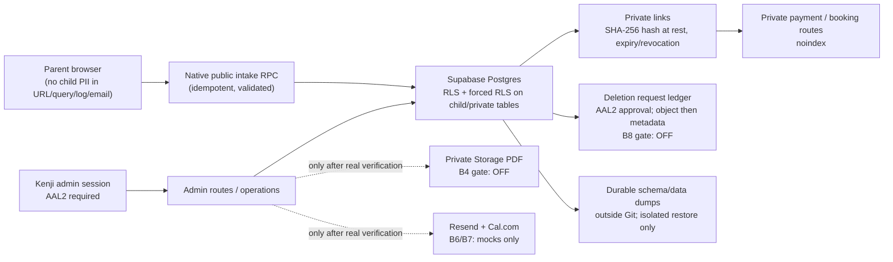

# B11 — Essence backend technical map

## System boundary

## Data and security map

| Area | Canonical control | Current evidence |
| --- | --- | --- |
| Parent / child intake | `create_hatmam_order_from_parent_intake`, validation, request-hash idempotency and consent version | B3 migration `0011`; public activation remains off |
| Hạt Mầm business terms | package snapshot, capacity 10/month, 5-business-day delivery, 7-day revision, 12/24-month retention defaults | B3 `0011`, B5 versioned settings `0014` |
| Admin access | `app_private.is_admin()` and AAL2 restrictive policies | B0 hardening and `0013`; public RPC helper is not exposed |
| Private routes | opaque raw token is never stored; SHA-256 token hashes have expiry/revocation | B0/B2 migrations and tests |
| Private publication | `hatmam_publication_assets` points only to the private Storage bucket and UUID-only object path | B4 `0012`; real trusted server E2E still blocked |
| Email / calendar | mock providers have idempotency but cannot send or book externally | B6/B7; no real account credentials connected |
| Deletion | hash-only request ledger, manual AAL2 approval, object-before-metadata adapter | B8 `0017`; real drill remains blocked |
| Recovery | durable, checksum-verified schema/data dumps outside Git; isolated restore only | B9 manifest; no restore drill |

## Migration map

`0001` and `0002` are canonical historical baseline markers. `0003`–`0017` are forward migrations and are aligned local/remote on `essence-staging`.

| Range | Purpose |
| --- | --- |
| `0003`–`0010` | AAL2/admin controls, token hashes, rate limiting, idempotency, and intake hardening |
| `0011` | Hạt Mầm safe-intake foundation and hard release gates |
| `0012`–`0013` | private Storage contract and non-public admin helper |
| `0014`–`0016` | versioned operations, mock email, mock calendar readiness |
| `0017` | retention rules and deletion-request ledger |

`supabase/migrations/` contains forward migrations only. Manual rollback scripts, if any, live under `supabase/rollbacks/` and are never run automatically. The preferred response to a migration defect is a corrective forward migration; snapshots are incident-only recovery evidence.

## Current release gates

The system is **not ready for public activation or production deployment**. These gates cannot be cleared by a unit, mock, or skipped test:

1. User-scoped AAL2 private Storage E2E and real dummy-object deletion are blocked by B4's documented server-side PostgREST/secret-key compatibility issue.
2. Resend, Cal.com, and their credential/domain/integration checks are not connected.
3. Security Advisor rerun is a Founder Dashboard checkpoint.
4. An isolated restore drill requires a disposable target and Founder incident approval.

No project, publishable, secret, anon, or service-role key appears in this document or in source control.
