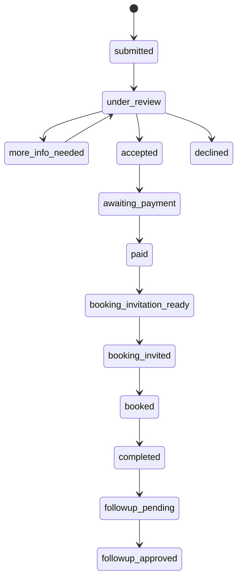
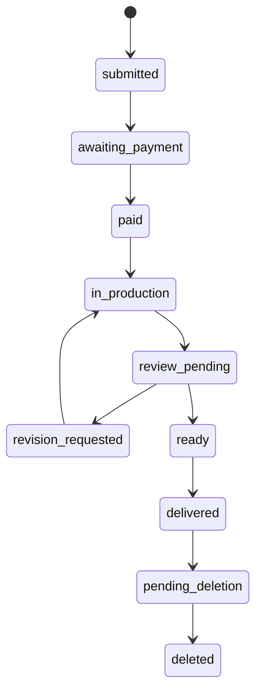

# WP3 — Launch Core backend

**Authority:** Founder-approved WP3 work order.  
**Scope:** shared foundation, Lặng vertical slice, Hạt Mầm vertical slice and
private Reading Room authorization.  
**Out of scope:** public activation/routes, CRM, subscriber identity,
assessment, membership, deferred products, providers and production deployment.

## Evidence labels and authority reconciliation

This record uses **CONFIRMED REPOSITORY FACT**, **FOUNDER DECISION**,
**CURRENT IMPLEMENTATION**, **PROPOSED IMPLEMENTATION**, **SYNTHETIC
EVIDENCE**, **STAGING EVIDENCE**, **OPEN GATE**, **MISSING FOUNDER INPUT**,
**CONFLICT** and **OUT OF SCOPE**.

**CONFIRMED REPOSITORY FACT:** `lang_applications`, `hatmam_orders`,
`hatmam_package_snapshots`, product-specific payment-request tables,
`payments`, `publications`, `hatmam_publication_assets`, `consents`,
`audit_log`, `data_deletion_requests` and AAL2 Admin guards already exist.
The historical random-token publication model conflicts with the later Founder
Decision requiring verified customer identity for the official Reading Room.
WP3 adopts the stricter identity-and-entitlement model; a token alone is never
authorization. Existing legacy KIDMAP/payment surfaces remain isolated.

## Launch Core and shared model

**FOUNDER DECISION:** the only Launch Core verticals are Lặng, Hạt Mầm and the
private Reading Room. WP3 extends existing tables instead of duplicating their
product facts:

| Reuse/extend | New normalized contract | Reason |
| --- | --- | --- |
| `lang_applications`, `hatmam_orders`, `hatmam_package_snapshots`, `payments`, product payment requests, `consents`, `audit_log` | `customer_identities`, `customer_identity_links`, `product_entitlements`, `entitlement_status_history`, `publication_versions`, `publication_reviews`, `revision_requests`, `support_requests`, `release_flags` | Existing product and payment records remain canonical; the new tables express identity, entitlement, versioning and safe release state once. |

The minimal customer identity stores a non-enumerable synthetic or verified
email hash, never a child name in an identifier/URL/object path. A future Auth
user link is optional and separate from `admin_users`. Customer sessions and
magic links are future adapter contracts, not a WP3 public account.

Orders retain their immutable product/package snapshot. Later settings or
prices cannot rewrite historical amount, delivery, revision or retention.
Payment evidence is product-scoped, hash/metadata only and may confirm one
order once. A report is not a confirmation. A confirmation checks request,
evidence, transfer reference, snapshot amount and non-revoked/non-expired
state atomically, then writes safe audit evidence.

## State machines

The database remains the transition authority. AI may create a clearly labelled
rule-based support summary only; it cannot decide Lặng suitability, confirm
payment, approve publication, grant entitlement or delete data. Booking stays
ineligible until confirmed payment and the booking provider flag remains OFF.

## Hạt Mầm, publication and Reading Room

Hạt Mầm requires approved consent before a package snapshot. The data boundary
is proportionate: no address, school, identifiers, diagnosis, detailed health
data, biometrics, media, transcript or unnecessary family detail. Safe codes
such as `HM-018` and `PUB-HM-018-V2` replace names in routes, paths, filenames,
logs and audit labels.

A publication draft is not delivered. Founder approval locks an immutable
publication version; a revision creates a new version and preserves old
approval/delivery history. An entitlement is granted only for the approved
version. The Reading Room checks verified customer identity and an active,
unexpired, unrevoked entitlement on every access; cross-customer access,
random-slug-only access, direct object access and stale access fail closed.

Private Storage/PDF is an adapter boundary. Object paths use only product,
order, publication code and version; checksums are stored before delivery. The
adapter must authorize before a short-lived signed URL and audit download
metadata. `private_storage_ready`, `pdf_generation_ready`,
`private_reading_room_enabled`, `customer_auth_ready` and all provider/public
flags default false. No real object, PDF, email, provider call or public route
is authorized by WP3.

## RLS, audit, support and deletion

All new tables use RLS plus deny-by-default grants. Admin reads require active
Admin plus AAL2; customer policies match only `auth.uid()` through a verified
identity link and active entitlement. There is no wildcard customer policy and
service role remains server-only. Audit records contain action, actor kind,
safe codes, state and timestamps—not raw intake, bank evidence or publication
content.

Support and revision are entitlement/order-bound, safe-code based and
product-snapshot gated. Revocation stops future access but is neither refund
nor deletion. Deletion is object-first: a metadata delete is blocked if the
private-object adapter fails; the request remains retryable and audited.

## Migration, staging and rollback

**PROPOSED IMPLEMENTATION:** forward migration `0022_wp3_launch_core_foundation.sql`
adds only additive tables, indexes, constraints, RLS/policies and OFF flags.
No old migration is edited, no schema is dropped and no business data is
rewritten. Its paired manual rollback removes only empty WP3 tables/flags and
must never run automatically; otherwise disable routes and use a reviewed
forward repair/verified staging restore. Staging application requires the
existing authenticated project authority, dry-run, non-destructive review and
a fresh pre-migration dump.

## Open gates and deferred work

**OPEN GATES:** canonical staging authenticated non-admin/AAL1/AAL2 evidence,
fresh Security Advisor, private Storage object E2E, signed download E2E,
real deletion E2E, Resend, Cal.com, bank evidence and provider authorization.
No local or synthetic result closes them.

**MISSING FOUNDER INPUT:** final customer route name, public/private delivery
copy, real provider authorization and any later product-specific policy not
already snapshoted. These do not block synthetic backend contracts.

**OUT OF SCOPE:** public ebook, subscriber/CRM, assessment, membership, adult
preview products, Khám Phá, Giao Mùa, Journey, AI recommendation, advanced
media, indexing and production deployment. M6 remains the only indexing
authority.
