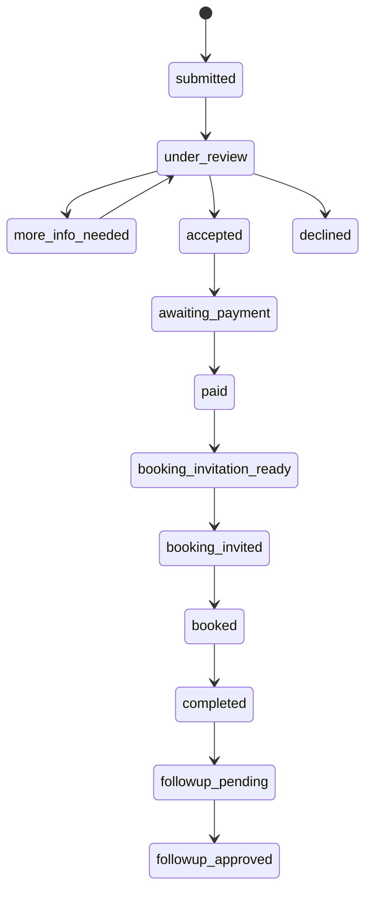
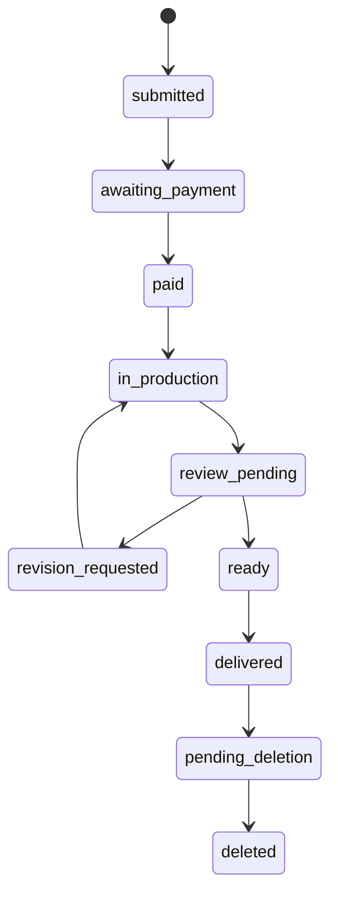

# WP3 — Launch Core backend

**Authority:** Founder-approved WP3 work order.  
**Scope:** shared foundation, Lặng vertical slice, Hạt Mầm vertical slice and
private Reading Room authorization.  
**Out of scope:** public activation/routes, CRM, subscriber identity,
assessment, membership, deferred products, providers and production deployment.

## Evidence labels and authority reconciliation

This record uses **CONFIRMED REPOSITORY FACT**, **FOUNDER DECISION**,
**CURRENT IMPLEMENTATION**, **PROPOSED IMPLEMENTATION**, **SYNTHETIC
EVIDENCE**, **STAGING EVIDENCE**, **OPEN GATE**, **MISSING FOUNDER INPUT**,
**CONFLICT** and **OUT OF SCOPE**.

**CONFIRMED REPOSITORY FACT:** `lang_applications`, `hatmam_orders`,
`hatmam_package_snapshots`, product-specific payment-request tables,
`payments`, `publications`, `hatmam_publication_assets`, `consents`,
`audit_log`, `data_deletion_requests` and AAL2 Admin guards already exist.
The historical random-token publication model conflicts with the later Founder
Decision requiring verified customer identity for the official Reading Room.
WP3 adopts the stricter identity-and-entitlement model; a token alone is never
authorization. Existing legacy KIDMAP/payment surfaces remain isolated.

## Launch Core and shared model

**FOUNDER DECISION:** the only Launch Core verticals are Lặng, Hạt Mầm and the
private Reading Room. WP3 extends existing tables instead of duplicating their
product facts:

| Reuse/extend | New normalized contract | Reason |
| --- | --- | --- |
| `lang_applications`, `hatmam_orders`, `hatmam_package_snapshots`, `payments`, product payment requests, `consents`, `audit_log` | `customer_identities`, `customer_identity_links`, `product_entitlements`, `entitlement_status_history`, `publication_versions`, `publication_reviews`, `revision_requests`, `support_requests`, `release_flags` | Existing product and payment records remain canonical; the new tables express identity, entitlement, versioning and safe release state once. |

The minimal customer identity stores a non-enumerable synthetic or verified
email hash, never a child name in an identifier/URL/object path. A future Auth
user link is optional and separate from `admin_users`. Customer sessions and
magic links are future adapter contracts, not a WP3 public account.

Orders retain their immutable product/package snapshot. Later settings or
prices cannot rewrite historical amount, delivery, revision or retention.
Payment evidence is product-scoped, hash/metadata only and may confirm one
order once. A report is not a confirmation. A confirmation checks request,
evidence, transfer reference, snapshot amount and non-revoked/non-expired
state atomically, then writes safe audit evidence.

## State machines

The database remains the transition authority. AI may create a clearly labelled
rule-based support summary only; it cannot decide Lặng suitability, confirm
payment, approve publication, grant entitlement or delete data. Booking stays
ineligible until confirmed payment and the booking provider flag remains OFF.

## Hạt Mầm, publication and Reading Room

Hạt Mầm requires approved consent before a package snapshot. The data boundary
is proportionate: no address, school, identifiers, diagnosis, detailed health
data, biometrics, media, transcript or unnecessary family detail. Safe codes
such as `HM-018` and `PUB-HM-018-V2` replace names in routes, paths, filenames,
logs and audit labels.

A publication draft is not delivered. Founder approval locks an immutable
publication version; a revision creates a new version and preserves old
approval/delivery history. An entitlement is granted only for the approved
version. The Reading Room checks verified customer identity and an active,
unexpired, unrevoked entitlement on every access; cross-customer access,
random-slug-only access, direct object access and stale access fail closed.

Private Storage/PDF is an adapter boundary. Object paths use only product,
order, publication code and version; checksums are stored before delivery. The
adapter must authorize before a short-lived signed URL and audit download
metadata. `private_storage_ready`, `pdf_generation_ready`,
`private_reading_room_enabled`, `customer_auth_ready` and all provider/public
flags default false. No real object, PDF, email, provider call or public route
is authorized by WP3.

## RLS, audit, support and deletion

All new tables use RLS plus deny-by-default grants. Admin reads require active
Admin plus AAL2; customer policies match only `auth.uid()` through a verified
identity link and active entitlement. There is no wildcard customer policy and
service role remains server-only. Audit records contain action, actor kind,
safe codes, state and timestamps—not raw intake, bank evidence or publication
content.

Support and revision are entitlement/order-bound, safe-code based and
product-snapshot gated. Revocation stops future access but is neither refund
nor deletion. Deletion is object-first: a metadata delete is blocked if the
private-object adapter fails; the request remains retryable and audited.

## Migration, staging and rollback

**CURRENT IMPLEMENTATION:** forward migrations
`0022_wp3_launch_core_foundation.sql`,
`0023_wp3_lang_payment_snapshot_and_confirmation.sql`,
`0024_wp3_publication_approval_and_entitlement.sql` and
`0025_wp3_fix_publication_function_lint.sql`,
`0026_wp3_bootstrap_operational_settings_v2.sql` and
`0027_wp3_fix_publication_metadata_token_compat.sql` are forward-only. They
add the new contracts, indexes, constraints, RLS/policies and OFF flags, then
repair function compatibility and bootstrap a complete versioned settings v2
only because staging v1 lacked the existing Lặng price contract. Existing order
snapshots remain untouched. No old migration was edited and no schema was
dropped. Manual rollback files are only for an empty/unconsumed scope;
otherwise disable the affected route and use a reviewed forward repair or a
verified staging restore. They must never run automatically.

**STAGING EVIDENCE (2026-08-04):** canonical project
`essence-staging` (`jmnkhlgumlvywdaeahmx`) showed `0001`–`0021` in sync. A
dry-run listed only `0022`–`0024`, then they were applied. A database-lint
error in the publication version function was repaired by forward migration
`0025`; then `0026` made the already-approved Working Defaults available as
immutable future-order settings v2 and `0027` repaired the historical
publication-hash compatibility. The final history is `0001`–`0027` in sync and
`supabase db lint` returned no schema errors. All WP3 release flags remain
constrained to false. The test transport used CLI-authenticated, in-memory
credentials only; no key was committed, printed or retained.

**STAGING EVIDENCE:** a pre-`0022`–`0024` schema/data snapshot is stored
outside Git at
`/Users/macos/Documents/03. RESOURCES/coachkenjipham-backups/essence-staging/2026-08-04-pre-0022-0024/`
with SHA-256 `de1d7581eeb4519990f3b3d040e9a5aacd6f5e69170c740d045fa73e81ef3879`
for `schema.sql` and
`8b312379ac8142531b39e825f24a1d3f1346e37e4222b5d36bedc3598553183b`
for `data.sql`. A pre-`0025` schema snapshot is stored at
`/Users/macos/Documents/03. RESOURCES/coachkenjipham-backups/essence-staging/2026-08-04-pre-0025/`
with SHA-256 `cf1641c0907126d9f9d3dda9bc17926be7347a935af337cc9631fde6bd89566e`.
Pre-`0026` schema/data snapshots are at
`/Users/macos/Documents/03. RESOURCES/coachkenjipham-backups/essence-staging/2026-08-04-pre-0026/`
with SHA-256 `efae90a60a602629af5b5c147ab22f14dbd199007fb482bac80f240f5f48a0b5`
for `schema.sql` and
`079a201d40e2b8929f46dd354fceb39609edb647a5c36cc72dd820eaae3220a5`
for `data.sql`. A pre-`0027` schema snapshot is at
`/Users/macos/Documents/03. RESOURCES/coachkenjipham-backups/essence-staging/2026-08-04-pre-0027/`
with matching schema SHA-256
`efae90a60a602629af5b5c147ab22f14dbd199007fb482bac80f240f5f48a0b5`.
Restore is manual: take the affected route OFF, verify target project and
checksum, restore to an isolated PostgreSQL environment first, then use a
reviewed forward repair or the recorded staging restore procedure. Never run
`db reset` or drop a schema.

**SYNTHETIC EVIDENCE:** anonymous RLS denial passed 11/11 against staging.
The synthetic database E2E completed Lặng snapshot creation, hash-at-rest,
report/evidence/confirmation atomicity, confirmation idempotency and revoked
request denial; it also completed Hạt Mầm approved-version-before-entitlement,
entitlement idempotency and checked every WP3 release flag OFF. This is not
provider E2E and does not close the Storage gate.

**STAGING EVIDENCE:** follow-up synthetic safety probes confirmed that an
existing package snapshot cannot be rewritten, payment evidence cannot be
reused across payment requests, and an entitlement-bound safe-code support
record can be retained without exposing child data. No customer or child data
was used in any probe.

**STAGING EVIDENCE:** synthetic Supabase Auth users proved authenticated
non-admin denial, active Admin AAL1 denial and AAL2 access against the real
RLS policies. The temporary TOTP secret, sessions and API keys stayed only in
process memory. This verifies the technical gate, not Founder enrollment.

## Open gates and deferred work

**OPEN GATES:** fresh Security Advisor, private Storage object E2E, signed
download E2E, real deletion E2E, Resend, Cal.com and provider authorization.
No local or synthetic result closes them. The manual bank-confirmation workflow
has only synthetic evidence in WP3; it is not a connected banking integration.
The Founder-authorized preview access is limited to WP3 review. It leaves
Vercel project protection, provider gates and public activation unchanged, and
does not grant access to Admin data without Supabase authentication and AAL2.

**MISSING FOUNDER INPUT:** final customer route name, public/private delivery
copy, real provider authorization and any later product-specific policy not
already snapshoted. These do not block synthetic backend contracts.

**OUT OF SCOPE:** public ebook, subscriber/CRM, assessment, membership, adult
preview products, Khám Phá, Giao Mùa, Journey, AI recommendation, advanced
media, indexing and production deployment. M6 remains the only indexing
authority.
